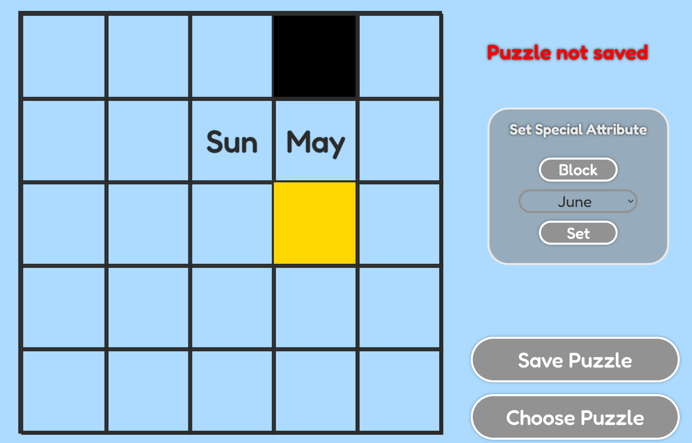

# NP-Dater

## NP-Complete Date puzzle solver

Tired of being stuck on those pesky (highly combinatorical) date puzzles for hours?  
NP-Dater to the rescue.

#### Table Of Contents (In Order)

- Project Showcase
- Technical Details
- Setup Instructions. 

## Project Showcase:

### Main Features

#### Create Grid and hex puzzles.

Ability to efficiently solve typically sized grid and hex puzzles. 

Grid Puzzle: 

 

Hex Puzzle: 

 

#### Customize board configuration

- Block Cells to edit shape of board,  
- Set date attributes in any cell you want.

#### Customize your tiles 

- Create and delete tiles, and  
- Effortlessly edit the *shape* and *colour* of tiles

#### When you are ready, solve for chosen date

- You can solve for any date, as long as it exists on your board. 

 

#### Your puzzles are saved.

- Automatically saves your puzzles
- Load them in (continue off of where you left), or delete them

### Other Features

- Warns you if your puzzle is too big, as it might take a long time to solve.
- Allows you to abort the solving process if it takes too long. 
- Redundant checks to ensure that the tiles coverage matches the board size.
- Will alert you if your puzzle configuration is not solvable for that particular date (not all instances have a solution)

## Technical Details:

#### Programming languages and tools

- Solver: C++ with Makefile
- Server: Express.js that spawns the C++ executable via background process. 
- Database: MySQL
- Frontend/UI: Vite + React JS, CSS.

#### Solver specific details

Due to the NP-Complete nature the puzzle my solver solves, here are some algorithmic details I used to minimize my solver's runtime. 

- Reduction to Exact Cover: Reduced my date puzzle to exact cover by generating all possible placements for each tile.
- MRV (Minimum Remaining Values): At each step, picks the tile with with the fewest amount of placements first to minimize the 
branching factor of the search tree.
- Domain Updating: After placing a tile, filter out each tile's valid placements to preemptively discard invalid placements, cutting
down on the searching required.
- Forward Checking: At each step, if any tile does not have valid placements, backtrack to avoid going further. 
- Bitmasking: Convert the Exact Cover instance to have each bit represent a coordinate as bits are very fast. 

Performance: Solves typical grid and hex puzzles (the ones shown in images) in around 1 and 4 seconds respectively on average.

## Setup Instructions: 

Make sure you have Node.js and MySQL installed on your computer. 

To setup MySQL, follow the instructions below: 

- Create a database called "np_dater"
- From the root directory, go the /backend/mysql/MySQL.js, and change the following properties:
    - port: By default is 3306, but change if your MySQL uses a different port
    - user: By default is 'root', but change if your usename is different
    - password: Change to your password.

If you are on Windows, you are all set. 

If you are on a mac, you would need to recompile the C++ file, which is simple. 

- From the root directory, simply go to /backend/cpp/cpp_runner, and type "make". 
- This will compile a mac version of the C++ executable. The Express.js will automatically determine the OS you are using.

### Run the program

- From the root directory, go to just /frontend, and type the following: <strong>npm start</strong>

